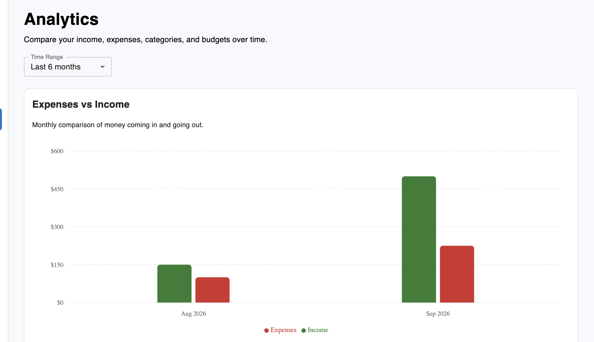
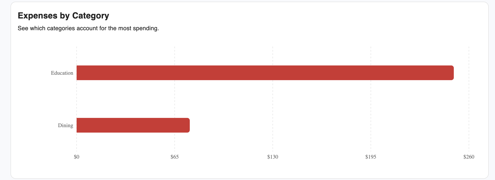
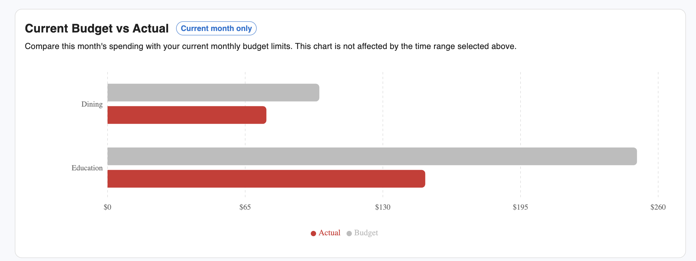

# FinTrack

FinTrack is a full-stack personal finance management application designed to help users organize and monitor their financial activity from a single platform.

The application allows users to manage financial accounts, record and categorize transactions, establish monthly budgets, and analyze financial activity over customizable time periods. A centralized dashboard provides an overview of account balances, monthly income and expenses, and recent financial activity, while the Analytics workspace provides visual comparisons of income, expenses, spending categories, and current budget performance.

FinTrack was built as a full-stack project with an emphasis on secure authentication, multi-user data isolation, RESTful API design, relational database modeling, backend validation, financial data integrity, and automated API testing.

---

## Core Features

- Secure user registration and authentication
- Financial account management
- Income and expense tracking
- Transaction categorization and filtering
- Monthly category-based budgeting
- Current-month budget spending calculations
- Financial analytics with interactive charts
- Income vs. expense analysis across selectable time ranges
- Expense analysis by transaction category
- Current-month budget vs. actual spending comparison
- Preset and custom date-range filtering
- Dashboard with financial summaries and recent transactions
- Account soft deletion that preserves financial history
- User-level data isolation across financial resources
- Responsive interface for desktop and mobile devices
- Backend validation and authorization
- Automated API and integration testing

---

## Technology Stack

FinTrack uses a full-stack JavaScript architecture with PostgreSQL for persistent relational data storage.

### Frontend

- Frontend: https://fintrack-app-opal.vercel.app

- **React** — Component-based user interface
- **Vite** — Frontend development and build tooling
- **Material UI (MUI)** — Responsive UI components and styling
- **Recharts** — Responsive financial data visualization and analytics charts
- **JavaScript (ES6+)** — Frontend application logic
- **Fetch API** — Communication with the backend REST API

### Backend
- Backend API: https://fintrack-api-acda.onrender.com

- **Node.js** — Server-side JavaScript runtime
- **Express.js** — REST API and server routing
- **PostgreSQL** — Relational database for application and financial data
- **node-postgres (pg)** — PostgreSQL integration for Node.js
- **JSON Web Tokens (JWT)** — Authentication and session verification
- **HTTP-only cookies** — Storage and transmission of authentication tokens

### Testing

- **Vitest** — Automated backend test runner
- **Supertest** — HTTP integration testing for Express API endpoints
- **Dedicated PostgreSQL test database** — Keeps automated tests isolated from development data

---

## Application Architecture

FinTrack follows a client-server architecture in which the React frontend communicates with an Express REST API. The backend handles authentication, authorization, validation, business logic, and database access.

```text
┌──────────────────────────────┐
│        React Frontend        │
│     Vite + Material UI       │
└──────────────┬───────────────┘
               │
               │ HTTP / JSON
               │
               ▼
┌──────────────────────────────┐
│       Express REST API       │
│                              │
│ Routes                       │
│ Authentication Middleware    │
│ Controllers                  │
│ Validation                   │
└──────────────┬───────────────┘
               │
               │
               ▼
       ┌───────────────┐
       │  PostgreSQL   │
       │               │
       │ Users         │
       │ Accounts      │
       │ Transactions  │
       │ Budgets       │
       │ Categories    │
       └───────────────┘
```

The frontend and backend are maintained as separate applications within the repository:

```text
fintrack/
├── client/       # React frontend
├── server/       # Express API and database layer
├── docs/
│   └── screenshots/
└── README.md
```

---

## Security & Authentication

FinTrack implements authentication and authorization at the backend API layer rather than relying solely on frontend route protection.

### Authentication Flow

1. The user signs in using their Google account.
2. Google authenticates the user's identity and returns an ID token to the frontend.
3. The frontend sends the Google credential to the FinTrack backend through `POST /api/auth/google`.
4. The backend verifies the Google ID token using Google's authentication library and the application's Google OAuth Client ID.
5. For a first-time user, FinTrack creates a local user record containing the verified Google identity information. Returning users are matched using their Google ID.
6. After successful authentication, FinTrack creates its own JSON Web Token (JWT) containing the user's internal FinTrack user ID.
7. The JWT is stored in an HTTP-only cookie and automatically included with protected API requests.
8. Authentication middleware verifies the JWT and attaches the authenticated user's identity to the request.
9. Controllers use the authenticated user's internal database ID to restrict access to user-owned resources.

FinTrack does not store or manage user passwords. Google is responsible for authenticating the user's identity, while FinTrack maintains its own application session and authorization model.

This provides user-level data isolation for financial accounts, transactions, and budgets.

### Additional Backend Protections

- Parameterized PostgreSQL queries
- Server-side input validation
- Email normalization
- Google ID token verification
- Verified Google email validation
- Account ownership verification
- Transaction ownership verification
- Budget ownership verification
- Validation of transaction types and account types
- Prevention of future-dated transactions
- Validation of financial numeric values

---

## Data Model

FinTrack uses a relational PostgreSQL data model designed around user ownership, financial history, and reusable transaction categories.

### Core Entities

```text
Users
  │
  ├─────────────── Accounts
  │                    │
  │                    └──────── Transactions ─────── Categories
  │
  └─────────────── Budgets ───────────────────────── Categories
```

### Users

Users represent authenticated FinTrack accounts. User-owned financial resources are associated with the authenticated user's database ID.

### Accounts

Accounts represent financial accounts such as checking, savings, credit, and cash accounts.

Each account belongs to a user and maintains both a starting balance and a current balance.

The starting balance represents the account value entered by the user when the account is created or edited. The current balance reflects the starting balance plus the cumulative effect of income and expense transactions.

When a transaction is created, updated, moved between accounts, or deleted, the backend automatically adjusts the affected account balance. These operations use PostgreSQL transactions so the transaction record and account balance remain synchronized.

Editing an account's starting balance adjusts the current balance by the difference between the old and new starting balance while preserving the effect of existing transactions.

Current balances are stored directly on account records rather than recalculated from the complete transaction history on every request, allowing balance retrieval and dashboard calculations to remain efficient as transaction history grows.

Each account belongs to a user.

### Transactions

Transactions belong to financial accounts and may reference one of FinTrack's global transaction categories.

Because accounts belong to users, transaction access is restricted through account ownership.

### Categories

Categories are global application reference data shared across users.

Examples include:

- Groceries
- Housing
- Dining
- Transportation
- Healthcare
- Salary
- Investments

### Budgets

Budgets associate a user with a category and a monthly spending limit.

A database uniqueness constraint prevents a user from creating multiple budgets for the same category.

---

## Financial History and Account Soft Deletion

Financial applications should preserve historical activity even when a user no longer wants an account displayed as active.

For this reason, FinTrack uses **soft deletion** for financial accounts rather than permanently deleting them.

When an account is removed, FinTrack records a deletion timestamp:

```text
Active Account
deleted_at = NULL
        │
        │ User removes account
        ▼
Archived Account
deleted_at = timestamp
```

Archived accounts no longer appear in the user's active account list and cannot receive new transactions.

However, the account record remains in PostgreSQL so its historical transactions can continue to appear in transaction history, budget calculations, and other historical financial records.

This preserves referential integrity and prevents historical financial data from disappearing when an account is archived.

---

## Automated Testing

FinTrack includes backend integration and API tests using Vitest and Supertest.

Tests run against a dedicated PostgreSQL test database (`fintrack_test`) so automated testing remains isolated from development data.

The test suite currently contains **46 automated tests**:

| Area | Tests |
|---|---:|
| Health / Infrastructure | 2 |
| Authentication | 8 |
| Accounts | 10 |
| Transactions | 17 |
| Budgets | 9 |
| Analytics | 6 |
| **Total** | **52** |

### Test Coverage Areas

The automated test suite verifies behaviors including:

- Google authentication and user creation
- Returning Google user authentication
- Google account linking by verified email
- Authentication cookie handling
- Protected API endpoints
- User-level data isolation
- Account creation and validation
- Account authorization
- Account soft deletion
- Account starting-balance and current-balance synchronization
- Transaction authorization
- Transaction amount, type, and date validation
- Income and expense effects on account balances
- Balance reversal when transactions are deleted
- Balance recalculation when transaction amounts or types are updated
- Balance synchronization when transactions are moved between accounts
- Prevention of transactions against unauthorized accounts
- Preservation of transactions from archived accounts
- Budget validation and duplicate prevention
- Cross-user budget-spending isolation
- Monthly income and expense analytics aggregation
- Analytics date-range filtering
- Expense aggregation by transaction category
- Analytics user-level data isolation

### Running Tests

From the backend directory:

```bash
npm test
```

---

## Local Development Setup

### Prerequisites

Before running FinTrack locally, make sure you have:

- Node.js
- npm
- PostgreSQL
- Git

### 1. Clone the Repository

```bash
git clone <your-repository-url>
cd fintrack
```

### 2. Create the Databases

Create the development and testing PostgreSQL databases:

```sql
CREATE DATABASE fintrack;
CREATE DATABASE fintrack_test;
```

FinTrack includes a database initialization script at:

```text
server/db/schema.sql
```

Initialize the development database:

```bash
psql -U your_postgres_user -d fintrack -f server/db/schema.sql
```

Initialize the test database:

```bash
psql -U your_postgres_user -d fintrack_test -f server/db/schema.sql
```

The initialization script creates the required tables, relationships, constraints, indexes, and default application categories.

### 3. Configure the Backend

Navigate to the server directory and install dependencies:

```bash
cd server
npm install
```

Create a `.env` file inside `server/`:

```env
DB_HOST=localhost
DB_PORT=5432
DB_NAME=fintrack
DB_USER=your_postgres_user
DB_PASSWORD=your_postgres_password

JWT_SECRET=your_jwt_secret
GOOGLE_CLIENT_ID=your_google_oauth_client_id
```

Environment files contain sensitive credentials and should never be committed to version control.

### 4. Configure the Test Environment

Create `.env.test` inside `server/`:

```env
DB_HOST=localhost
DB_PORT=5432
DB_NAME=fintrack_test
DB_USER=your_postgres_user
DB_PASSWORD=your_postgres_password

JWT_SECRET=your_test_jwt_secret
GOOGLE_CLIENT_ID=your_google_oauth_client_id
```

### 5. Configure the Frontend

From the project root:

```bash
cd client
npm install
```

Create a `.env` file inside `client/`:

```env
VITE_API_URL=http://localhost:3000
VITE_GOOGLE_CLIENT_ID=your_google_oauth_client_id
```

### 6. Start the Backend

From `server/`:

```bash
npm run dev
```

The development API runs at:

```text
http://localhost:3000
```

### 7. Start the Frontend

In a separate terminal, from `client/`:

```bash
npm run dev
```

Vite will normally make the frontend available at:

```text
http://localhost:5173
```

### 8. Run the Automated Tests

From `server/`:

```bash
npm test
```

The test suite automatically uses the dedicated `fintrack_test` database when running in the test environment.

## Development Workflow

FinTrack uses a two-environment development workflow:

### Development

Development is performed locally using feature or bug-fix branches.

- React/Vite frontend runs locally
- Express API runs locally
- PostgreSQL runs locally
- Environment variables are stored in local `.env` files and are excluded from Git

New work is developed on short-lived branches such as:

`feature/landing-page`

or:

`fix/example-bug`

Changes are tested locally before being merged into `main`.

### Production

The `main` branch represents production-ready code.

When changes are merged into `main` and pushed to GitHub:

- Vercel automatically deploys the React frontend
- Render automatically deploys the Express API
- The production API connects to Neon PostgreSQL

Production secrets and configuration are managed through Vercel and Render environment variables rather than committed `.env` files.

---

## Application Preview

### Dashboard


The dashboard provides a centralized overview of the user's finances, including total account balance, monthly income and expenses, and recent transaction activity.

### Account Management


Users can manage multiple financial accounts, including checking, savings, credit, and cash accounts. Accounts support editing and soft deletion so historical transaction data remains preserved.

### Transaction Management


Transactions can be created, edited, deleted, and filtered by account, category, transaction type, and date range. Transaction history remains available even when the associated account has been archived.

### Budget Tracking


Users can create monthly category budgets and monitor current-month spending through dynamically calculated totals and progress indicators.

### Financial Analytics





The Analytics workspace provides interactive financial visualizations for comparing monthly income and expenses, analyzing spending by category, and evaluating current-month spending against category budget limits. Preset and custom date ranges can be used to explore historical transaction activity.

Budget vs. actual comparisons reflect the current month because FinTrack's budget model stores current monthly category limits rather than historical budget versions.

---

## Project Status

FinTrack currently supports the complete core workflow for:

- User authentication
- Financial account management
- Transaction tracking
- Monthly budgeting
- Financial dashboard reporting
- Financial analytics and data visualization
- Multi-user authorization
- Automated backend testing

The application is deployed in production using Vercel for the frontend, Render for the backend API, and Neon PostgreSQL for the production database.

---

## Author
Jonathan G. Diaz Ortiz
Developed as a full-stack software engineering project.