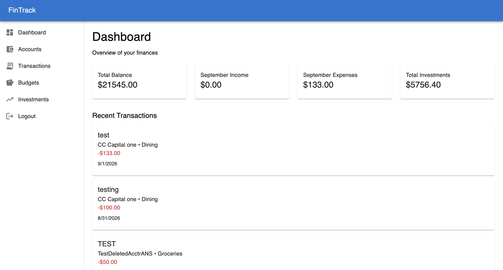
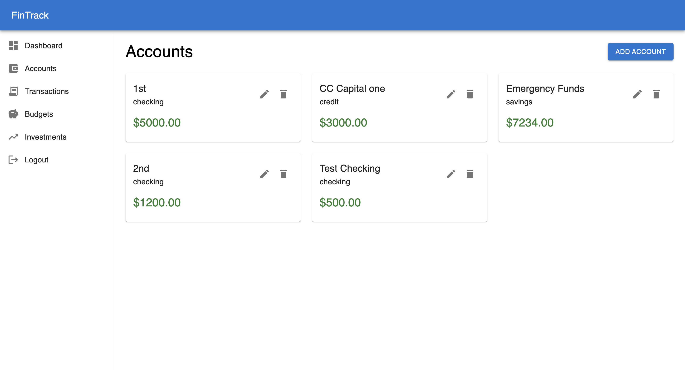
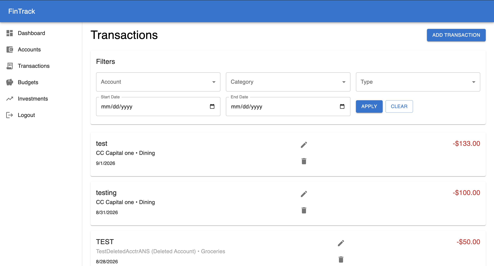
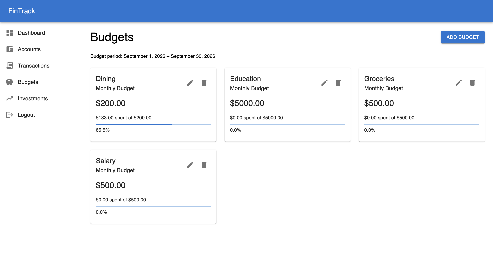
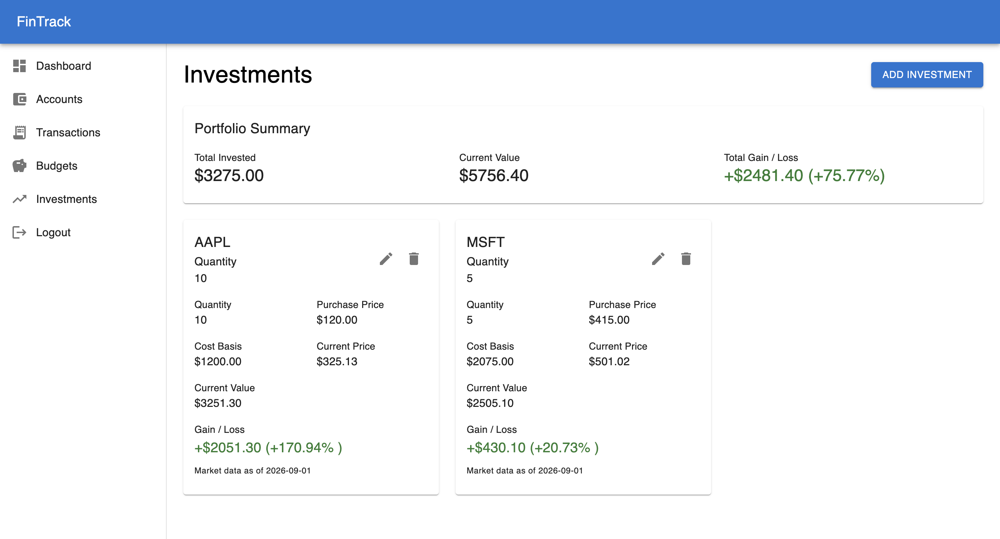

# FinTrack

FinTrack is a full-stack personal finance management application designed to help users organize and monitor their financial activity from a single platform.

The application allows users to manage financial accounts, record and categorize transactions, establish monthly budgets, and track investment holdings using current market data. A centralized dashboard provides an overview of account balances, monthly income and expenses, investment value, and recent financial activity.

FinTrack was built as a full-stack portfolio project with an emphasis on secure authentication, multi-user data isolation, RESTful API design, relational database modeling, backend validation, financial data integrity, and automated API testing.

---

## Core Features

- Secure user registration and authentication
- Financial account management
- Income and expense tracking
- Transaction categorization and filtering
- Monthly category-based budgeting
- Current-month budget spending calculations
- Investment portfolio tracking
- External stock market data integration
- Dashboard with financial summaries and recent transactions
- Account soft deletion that preserves financial history
- User-level data isolation across financial resources
- Responsive interface for desktop and mobile devices
- Backend validation and authorization
- Automated API and integration testing

---

## Technology Stack

FinTrack uses a full-stack JavaScript architecture with PostgreSQL for persistent relational data storage.

### Frontend

- **React** — Component-based user interface
- **Vite** — Frontend development and build tooling
- **Material UI (MUI)** — Responsive UI components and styling
- **JavaScript (ES6+)** — Frontend application logic
- **Fetch API** — Communication with the backend REST API

### Backend

- **Node.js** — Server-side JavaScript runtime
- **Express.js** — REST API and server routing
- **PostgreSQL** — Relational database for application and financial data
- **node-postgres (pg)** — PostgreSQL integration for Node.js
- **bcrypt** — Password hashing
- **JSON Web Tokens (JWT)** — Authentication and session verification
- **HTTP-only cookies** — Storage and transmission of authentication tokens

### External Services

- **Alpha Vantage API** — Stock market data used to calculate current investment values and portfolio performance
- **In-memory caching** — Reduces unnecessary external market-data requests and helps manage API usage limits

### Testing

- **Vitest** — Automated backend test runner
- **Supertest** — HTTP integration testing for Express API endpoints
- **Dedicated PostgreSQL test database** — Keeps automated tests isolated from development data

---

## Application Architecture

FinTrack follows a client-server architecture in which the React frontend communicates with an Express REST API. The backend handles authentication, authorization, validation, business logic, database access, and external market-data integration.

```text
┌──────────────────────────────┐
│        React Frontend        │
│     Vite + Material UI       │
└──────────────┬───────────────┘
               │
               │ HTTP / JSON
               │
               ▼
┌──────────────────────────────┐
│       Express REST API       │
│                              │
│ Routes                       │
│ Authentication Middleware    │
│ Controllers                  │
│ Validation                   │
└──────────────┬───────────────┘
               │
         ┌─────┴─────────┐
         │               │
         ▼               ▼
┌───────────────┐  ┌─────────────────┐
│  PostgreSQL   │  │  Market Service │
│               │  │  + Quote Cache  │
│ Users         │  └────────┬────────┘
│ Accounts      │           │
│ Transactions  │           ▼
│ Budgets       │  ┌─────────────────┐
│ Categories    │  │  Alpha Vantage  │
│ Investments   │  │       API       │
└───────────────┘  └─────────────────┘
```

The frontend and backend are maintained as separate applications within the repository:

```text
fintrack/
├── client/       # React frontend
├── server/       # Express API and database layer
├── docs/
│   └── screenshots/
└── README.md
```

---

## Security & Authentication

FinTrack implements authentication and authorization at the backend API layer rather than relying solely on frontend route protection.

### Authentication Flow

1. A user registers with their name, email address, and password.
2. Passwords are hashed using bcrypt before being stored in PostgreSQL.
3. After successful authentication, the backend creates a JSON Web Token (JWT).
4. The JWT is stored in an HTTP-only cookie.
5. Protected API requests include the authentication cookie automatically.
6. Authentication middleware validates the token and attaches the authenticated user's identity to the request.
7. Controllers use the authenticated user ID to restrict access to user-owned resources.

This provides user-level data isolation for financial accounts, transactions, budgets, and investments.

### Additional Backend Protections

- Parameterized PostgreSQL queries
- Server-side input validation
- Email normalization
- Password-length validation
- Account ownership verification
- Transaction ownership verification
- Budget ownership verification
- Investment ownership verification
- Validation of transaction types and account types
- Prevention of future-dated transactions
- Validation of financial numeric values
- External stock-symbol validation
- Graceful handling of external market-data failures

---

## Data Model

FinTrack uses a relational PostgreSQL data model designed around user ownership, financial history, and reusable transaction categories.

### Core Entities

```text
Users
  │
  ├─────────────── Accounts
  │                    │
  │                    └──────── Transactions ─────── Categories
  │
  ├─────────────── Budgets ───────────────────────── Categories
  │
  └─────────────── Investments
```

### Users

Users represent authenticated FinTrack accounts. User-owned financial resources are associated with the authenticated user's database ID.

### Accounts

Accounts represent financial accounts such as checking, savings, credit, and cash accounts.

Each account belongs to a user.

### Transactions

Transactions belong to financial accounts and may reference one of FinTrack's global transaction categories.

Because accounts belong to users, transaction access is restricted through account ownership.

### Categories

Categories are global application reference data shared across users.

Examples include:

- Groceries
- Housing
- Dining
- Transportation
- Healthcare
- Salary
- Investments

### Budgets

Budgets associate a user with a category and a monthly spending limit.

A database uniqueness constraint prevents a user from creating multiple budgets for the same category.

### Investments

Investment records belong directly to users and store:

- Stock symbol
- Quantity
- Purchase price

Current market values and gain/loss calculations are derived using market data retrieved from Alpha Vantage.

---

## Financial History and Account Soft Deletion

Financial applications should preserve historical activity even when a user no longer wants an account displayed as active.

For this reason, FinTrack uses **soft deletion** for financial accounts rather than permanently deleting them.

When an account is removed, FinTrack records a deletion timestamp:

```text
Active Account
deleted_at = NULL
        │
        │ User removes account
        ▼
Archived Account
deleted_at = timestamp
```

Archived accounts no longer appear in the user's active account list and cannot receive new transactions.

However, the account record remains in PostgreSQL so its historical transactions can continue to appear in transaction history, budget calculations, and other historical financial records.

This preserves referential integrity and prevents historical financial data from disappearing when an account is archived.

---

## Automated Testing

FinTrack includes backend integration and API tests using Vitest and Supertest.

Tests run against a dedicated PostgreSQL test database (`fintrack_test`) so automated testing remains isolated from development data.

The test suite currently contains **50 automated tests**:

| Area | Tests |
|---|---:|
| Health / Infrastructure | 2 |
| Authentication | 9 |
| Accounts | 9 |
| Transactions | 11 |
| Budgets | 9 |
| Investments | 10 |
| **Total** | **50** |

### Test Coverage Areas

The automated test suite verifies behaviors including:

- User registration and login
- Authentication cookie handling
- Protected API endpoints
- User-level data isolation
- Account creation and validation
- Account authorization
- Account soft deletion
- Transaction authorization
- Transaction amount, type, and date validation
- Prevention of transactions against unauthorized accounts
- Preservation of transactions from archived accounts
- Budget validation and duplicate prevention
- Cross-user budget-spending isolation
- Investment ownership
- Investment numeric validation
- Stock-symbol validation
- External market-data service failure handling

External market-data requests are mocked during automated testing. This keeps tests deterministic, avoids consuming external API quotas, and prevents network availability from affecting test results.

### Running Tests

From the backend directory:

```bash
npm test
```

---

## Local Development Setup

### Prerequisites

Before running FinTrack locally, make sure you have:

- Node.js
- npm
- PostgreSQL
- Git
- An Alpha Vantage API key

### 1. Clone the Repository

```bash
git clone <your-repository-url>
cd fintrack
```

### 2. Create the Databases

Create the development and testing PostgreSQL databases:

```sql
CREATE DATABASE fintrack;
CREATE DATABASE fintrack_test;
```

FinTrack includes a database initialization script at:

```text
server/db/schema.sql
```

Initialize the development database:

```bash
psql -U your_postgres_user -d fintrack -f server/db/schema.sql
```

Initialize the test database:

```bash
psql -U your_postgres_user -d fintrack_test -f server/db/schema.sql
```

The initialization script creates the required tables, relationships, constraints, indexes, and default application categories.

### 3. Configure the Backend

Navigate to the server directory and install dependencies:

```bash
cd server
npm install
```

Create a `.env` file inside `server/`:

```env
DB_HOST=localhost
DB_PORT=5432
DB_NAME=fintrack
DB_USER=your_postgres_user
DB_PASSWORD=your_postgres_password

JWT_SECRET=your_jwt_secret

ALPHA_VANTAGE_API_KEY=your_alpha_vantage_api_key
```

Environment files contain sensitive credentials and should never be committed to version control.

### 4. Configure the Test Environment

Create `.env.test` inside `server/`:

```env
DB_HOST=localhost
DB_PORT=5432
DB_NAME=fintrack_test
DB_USER=your_postgres_user
DB_PASSWORD=your_postgres_password

JWT_SECRET=your_test_jwt_secret
```

The automated investment tests mock external market-data requests, so they do not require live Alpha Vantage requests.

### 5. Configure the Frontend

From the project root:

```bash
cd client
npm install
```

Create a `.env` file inside `client/`:

```env
VITE_API_URL=http://localhost:3000
```

### 6. Start the Backend

From `server/`:

```bash
npm run dev
```

The development API runs at:

```text
http://localhost:3000
```

### 7. Start the Frontend

In a separate terminal, from `client/`:

```bash
npm run dev
```

Vite will normally make the frontend available at:

```text
http://localhost:5173
```

### 8. Run the Automated Tests

From `server/`:

```bash
npm test
```

The test suite automatically uses the dedicated `fintrack_test` database when running in the test environment.

---

## Application Preview

### Dashboard



The dashboard provides a centralized overview of the user's finances, including total account balance, monthly income and expenses, investment value, and recent transaction activity.

### Account Management



Users can manage multiple financial accounts, including checking, savings, credit, and cash accounts. Accounts support editing and soft deletion so historical transaction data remains preserved.

### Transaction Management



Transactions can be created, edited, deleted, and filtered by account, category, transaction type, and date range. Transaction history remains available even when the associated account has been archived.

### Budget Tracking



Users can create monthly category budgets and monitor current-month spending through dynamically calculated totals and progress indicators.

### Investment Portfolio



The investment portfolio tracks holdings, cost basis, current value, and gain or loss. Current market prices are retrieved through the Alpha Vantage API and cached by the backend to reduce external API requests.

---

## Project Status

FinTrack currently supports the complete core workflow for:

- User authentication
- Financial account management
- Transaction tracking
- Monthly budgeting
- Investment portfolio tracking
- Financial dashboard reporting
- Multi-user authorization
- Automated backend testing

The application is currently being prepared for production deployment.

---

## Author
Jonathan G. Diaz Ortiz
Developed as a full-stack software engineering project.